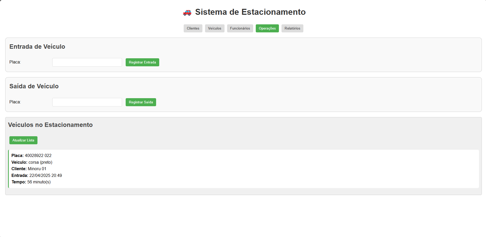

# Organização do HTML, CSS e JavaScript no Sistema de Estacionamento

[A aplicação de gerenciamento de estacionamento foi construída como uma aplicação de página única (SPA) com todos os seus componentes - HTML, CSS e JavaScript - incorporados em um único arquivo. Vamos analisar como cada parte foi estruturada:](.\Index.html)

## Estrutura HTML

A estrutura HTML está organizada em seções principais que correspondem às diferentes funcionalidades do sistema:

1. **Cabeçalho**: Contém o título principal da aplicação e a navegação por abas
2. **Sistema de Navegação**: Botões para alternar entre as diferentes funcionalidades
3. **Seções de Conteúdo**: Cada aba tem sua própria seção (`
`) com ID específico e classe `tab-content`:
   - `tab-cliente`: Formulários e listagem de clientes
   - `tab-veiculo`: Formulários e listagem de veículos
   - `tab-funcionario`: Formulários e listagem de funcionários
   - `tab-operacoes`: Funcionalidades de entrada/saída de veículos
   - `tab-relatorios`: Exibição de relatórios de operações finalizadas

Cada seção contém formulários com inputs, labels, botões e divs para exibição dinâmica de dados. A estrutura é relativamente simples e direta, com formulários para entrada de dados e containers para exibição de resultados.

## Estilização CSS

O CSS está embutido na página dentro de uma tag `<style>` no `<head>` do documento. Ele define:

1. **Estilos Globais**: 
   - Fonte base (Arial)
   - Margens e espaçamentos
   - Propriedades de linha

2. **Estilização de Componentes**:
   - Seções (`section`) com bordas, padding e background
   - Inputs e selects padronizados
   - Botões com cores, animações e estilos de hover
   - Títulos com cores e alinhamento
   - Listas estilizadas para exibição de dados

3. **Sistema de Abas**:
   - `.tab-navigation` para a barra de navegação
   - `.tab-content` para os painéis de conteúdo
   - `.active` para o estado ativo da aba
   - Transições para mostrar/ocultar conteúdo

Esta abordagem de CSS inline não utiliza pré-processadores ou arquivos externos, mantendo tudo em um único arquivo para simplicidade.

## Implementação JavaScript

O JavaScript está no final do arquivo, dentro de uma tag `<script>`. Ele é responsável pela lógica de negócios e interatividade da aplicação. A organização é feita da seguinte forma:

1. **Definição de Classes**:
   - `Pessoa`: Classe abstrata base
   - `Cliente`: Extends Pessoa
   - `Veiculo`: Armazena informações dos veículos
   - `Funcionario`: Extends Pessoa
   - `RegistroEstacionamento`: Gerencia registros de estacionamento

2. **Utilitário de Armazenamento**:
   - Objeto `storage` encapsula operações com o localStorage
   - Métodos para get, set, add, remove e update

3. **Funções de Interface**:
   - `showTab()`: Gerencia a navegação entre abas
   - Funções de listagem para cada entidade (clientes, veículos, etc.)

4. **Funções CRUD**:
   - Para cada entidade (Cliente, Veículo, Funcionário):
     - Funções de cadastro
     - Funções de listagem
     - Funções de edição
     - Funções de remoção
     - Funções de limpeza de formulário

5. **Funções de Negócio**:
   - `registrarEntrada()`: Processa entrada de veículos
   - `registrarSaida()`: Processa saída e calcula valores
   - `calcularCusto()`: Implementa a lógica de cobrança
   - `calcularTempoEstacionado()`: Calcula tempo de permanência
   - `formatarData()`: Formata datas para exibição

6. **Inicialização**:
   - Evento `window.onload` para inicializar os dados e a interface

## Integração dos Componentes

A integração entre HTML, CSS e JavaScript ocorre através de:

1. **Seletores DOM**: JavaScript acessa elementos HTML por ID para:
   - Ler valores de formulários
   - Atualizar conteúdo dinâmico
   - Adicionar event listeners

2. **Manipulação de Classes CSS**: JavaScript altera classes para:
   - Mostrar/ocultar abas (usando as classes `.active` e `.tab-content`)
   - Alterar estados visuais de componentes

3. **Event Listeners**: Atribuídos inline nos elementos HTML:
   - `onclick="funcao()"` em botões para chamar funções JavaScript
   - Alternância dinâmica entre modo de criação e edição

Esta abordagem "tudo-em-um" é mais simples para aplicações pequenas a médias, facilita o compartilhamento do código e não requer servidor para gerenciar múltiplos arquivos. Entretanto, para projetos maiores, seria recomendável separar os componentes em arquivos distintos para melhorar a manutenibilidade.