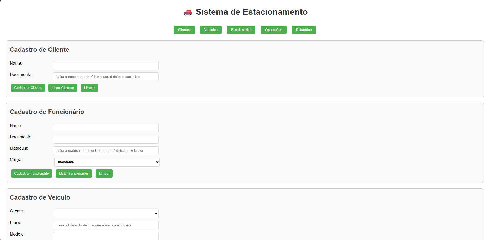
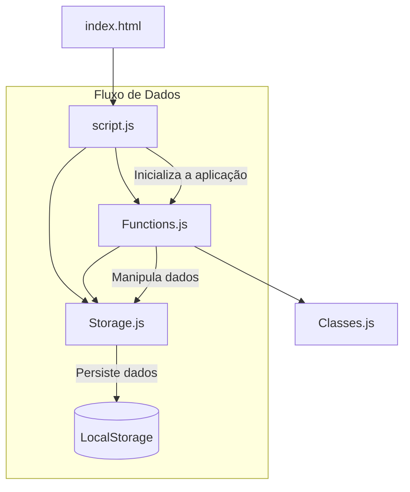

# Sistema de Estacionamento 

[Este é um sistema web para gerenciamento de estacionamento desenvolvido com HTML, CSS e JavaScript, usando a arquitetura de módulos ES6 para organizar o código de forma eficiente.]()

- [Sistema de Estacionamento 00](Estacionamento-00/Index.html)
- [Sistema de Estacionamento 01](https://minoru-yamanaka.github.io/atividade_estacionamento_tii06/)


## Visão Geral da Arquitetura

O projeto é estruturado em componentes modulares, cada um com responsabilidades específicas:

```
Sistema-Estacionamento/
│
├── index.html                 # Interface principal da aplicação
├── css/
│   └── style.css              # Estilos e responsividade
│
└── js/
    ├── script.js              # Ponto de entrada principal - inicializa a aplicação
    ├── Storage.js             # Gerenciamento de armazenamento local
    ├── Functions.js           # Implementação das funcionalidades principais
    └── Classes.js             # Definição das classes e estrutura de dados
```

## Fluxo de Dados e Relacionamentos entre Módulos



</br>
# Módulos e suas Responsabilidades

### 1. `script.js`
Funciona como o ponto de entrada da aplicação:

- **Importa de:**
  - `Storage.js`: `{ db, LocalStorageManager }`
  - `Functions.js`: Todas as funções de manipulação (cadastro, listagem, operações)

- **Responsabilidades:**
  - Inicialização do banco de dados a partir do localStorage
  - Configuração dos event listeners para os elementos da interface
  - Conexão entre a interface HTML e a lógica de negócio

```javascript
// Exemplo de imports em script.js
import { db, LocalStorageManager } from './Storage.js';
import {
    cadastrarCliente,
    listarClientes,
    // ...outras funções
} from './Functions.js';
```

### 2. `Storage.js`
Gerencia o armazenamento e persistência de dados:

- **Exporta:**
  - `LocalStorageManager`: Objeto com métodos para salvar e carregar dados
  - `db`: Objeto central que mantém as coleções de dados da aplicação

- **Responsabilidades:**
  - Abstração das operações de localStorage
  - Inicialização do estado da aplicação

```javascript
// Exports de Storage.js
export const LocalStorageManager = {
    salvarDados(chave, dados) { /* ... */ },
    carregarDados(chave) { /* ... */ }
};

export const db = {
    clientes: [...],
    funcionarios: [...],
    veiculos: [...],
    registrosEstacionamento: [...]
};
```

### 3. `Functions.js`
Contém a implementação das funcionalidades do sistema:

- **Importa de:**
  - `Storage.js`: `{ db, LocalStorageManager }`

- **Exporta:** Diversas funções para manipulação de:
  - Clientes
  - Funcionários
  - Veículos
  - Operações de estacionamento
  - Relatórios

- **Responsabilidades:**
  - Lógica de negócio da aplicação
  - Validação de dados
  - Interação com o banco de dados
  - Atualização da interface do usuário

```javascript
// Exemplo de imports/exports em Functions.js
import { db, LocalStorageManager } from './Storage.js';

// Implementação das funções...

export {
    cadastrarCliente,
    listarClientes,
    // ...outras funções
};
```

### 4. `Classes.js`
Define a estrutura de dados através de classes:

- **Exporta:**
  - `Pessoa`: Classe base abstrata
  - `Cliente`: Herda de Pessoa
  - `Funcionario`: Herda de Pessoa
  - `Veiculo`: Representa um veículo
  - `RegistroEstacionamento`: Representa uma operação de estacionamento

- **Responsabilidades:**
  - Definição do modelo de dados
  - Implementação dos conceitos de Programação Orientada a Objetos

```javascript
// Exports de Classes.js
export class Pessoa { /* ... */ }
export class Cliente extends Pessoa { /* ... */ }
export class Funcionario extends Pessoa { /* ... */ }
export class Veiculo { /* ... */ }
export class RegistroEstacionamento { /* ... */ }
```

## Funcionalidades Principais

O sistema permite gerenciar:

1. **Clientes**
   - Cadastro de novos clientes
   - Listagem de clientes cadastrados

2. **Funcionários**
   - Cadastro de funcionários com diferentes cargos
   - Listagem de funcionários

3. **Veículos**
   - Cadastro de veículos associados a clientes
   - Listagem de veículos cadastrados

4. **Operações de Estacionamento**
   - Registro de entrada de veículos
   - Registro de saída de veículos
   - Visualização de veículos atualmente estacionados

5. **Relatórios**
   - Visualização de histórico de entradas e saídas

## Persistência de Dados

Todos os dados são armazenados no localStorage do navegador para permitir a persistência entre sessões. O `LocalStorageManager` implementa:

- Conversão de objetos JavaScript para JSON para armazenamento
- Recuperação e desserialização dos dados ao iniciar a aplicação

## Padrões de Design Utilizados

1. **Modularização** - Separação de responsabilidades em módulos específicos
2. **Programação Orientada a Objetos** - Uso de classes para modelagem de dados
3. **Padrão Repository** - Abstração da persistência através do `LocalStorageManager`
4. **Event Delegation** - Para manipulação de eventos da interface do usuário

## Como Executar

Para executar este projeto:

1. Clone o repositório
2. Abra o arquivo `index.html` em um navegador moderno
   - Nota: É necessário executar em um servidor local devido às restrições de CORS dos módulos ES6

## Conclusão

O sistema de estacionamento foi desenvolvido com foco na modularização e separação de responsabilidades, facilitando a manutenção e expansão do código. A arquitetura baseada em módulos ES6 permite um acoplamento reduzido entre os componentes e uma melhor organização do código.

## Observações 📝

Vou detalhar melhor o componente de armazenamento (Storage) do sistema de estacionamento.

## O Storage.js - Gerenciador de Persistência de Dados

O arquivo `Storage.js` é um componente fundamental da arquitetura do sistema de estacionamento, responsável pela persistência de dados usando o localStorage do navegador. Este módulo resolve dois desafios essenciais:

1. Garantir que os dados persistam mesmo quando o navegador é fechado
2. Facilitar a manipulação de dados estruturados (objetos/arrays) no localStorage

### Estrutura e Componentes

O módulo `Storage.js` exporta dois elementos principais:

#### 1. LocalStorageManager

Este é um objeto utilitário que encapsula a lógica de persistência, fornecendo uma interface simplificada para operações de armazenamento:

```javascript
export const LocalStorageManager = {
    // Salva dados no localStorage
    salvarDados(chave, dados) {
        localStorage.setItem(chave, JSON.stringify(dados));
    },

    // Carrega dados do localStorage
    carregarDados(chave) {
        const dados = localStorage.getItem(chave);
        return dados ? JSON.parse(dados) : [];
    }
};
```

**Funções:**

- **salvarDados(chave, dados)**: 
  - Converte objetos/arrays JavaScript em strings JSON usando `JSON.stringify()`
  - Armazena no localStorage com a chave especificada
  - Permite armazenar estruturas de dados complexas

- **carregarDados(chave)**:
  - Recupera dados da chave especificada no localStorage
  - Converte de volta para objetos/arrays JavaScript usando `JSON.parse()`
  - Retorna um array vazio se nenhum dado for encontrado

#### 2. Objeto db (Database)

Este objeto funciona como um "banco de dados em memória" centralizado que mantém o estado da aplicação enquanto ela está em execução:

```javascript
export const db = {
    // Inicializa arrays para as entidades principais
    clientes: JSON.parse(localStorage.getItem('clientes')) || [],
    funcionarios: JSON.parse(localStorage.getItem('funcionarios')) || [],
    veiculos: JSON.parse(localStorage.getItem('veiculos')) || [],
    registrosEstacionamento: JSON.parse(localStorage.getItem('registrosEstacionamento')) || []
};
```

Este objeto:
- Inicializa arrays para cada tipo de entidade (clientes, funcionários, veículos, registros)
- Tenta carregar dados existentes do localStorage durante a inicialização
- Fornece uma estrutura de dados "em memória" para a aplicação trabalhar

### Fluxo de Dados

O fluxo de dados através do sistema de armazenamento funciona da seguinte forma:

1. **Inicialização**:
   - Quando a aplicação carrega, o `script.js` importa tanto `db` quanto `LocalStorageManager`
   - Os dados são carregados do localStorage para o objeto `db` em memória

2. **Operações de Leitura**:
   - Funções em `Functions.js` leem os dados diretamente do objeto `db`
   - Exemplo: `db.clientes.forEach(...)` para listar clientes

3. **Operações de Escrita**:
   - Quando dados são adicionados/modificados, primeiro são atualizados no objeto `db`
   - Em seguida, `LocalStorageManager.salvarDados()` é chamado para persistir no localStorage
   - Exemplo:
     ```javascript
     db.clientes.push(cliente);
     LocalStorageManager.salvarDados('clientes', db.clientes);
     ```

### Vantagens dessa Abordagem

1. **Abstração**: Esconde a complexidade de trabalhar diretamente com localStorage
2. **Centralização**: Dados armazenados em um único objeto (`db`)
3. **Conversão automática**: Lida com a serialização/desserialização JSON
4. **Valores padrão**: Fornece arrays vazios quando não existem dados
5. **Modularidade**: Separa a lógica de armazenamento da lógica de negócios

### Limitações e Considerações

1. **Capacidade limitada**: O localStorage tem um limite de tamanho (geralmente 5-10MB)
2. **Sem suporte para consultas complexas**: Não é um banco de dados real
3. **Sincronização**: Os dados são armazenados apenas no navegador local
4. **Segurança**: Os dados no localStorage são vulneráveis e não devem armazenar informações sensíveis

### Uso em Outras Partes do Sistema

O `Storage.js` é utilizado principalmente pelo `Functions.js`, que importa tanto o `db` quanto o `LocalStorageManager`:

```javascript
// Em Functions.js
import { db, LocalStorageManager } from './Storage.js';

function cadastrarCliente() {
    // ... validação e lógica de negócio ...
    
    // Adiciona ao db em memória
    db.clientes.push(cliente);
    
    // Persiste no localStorage
    LocalStorageManager.salvarDados('clientes', db.clientes);
    
    // ... atualiza UI ...
}
```

### Potenciais Melhorias

Para uma aplicação mais robusta, o sistema de armazenamento poderia ser expandido com:

1. **Validação de Dados**: Verificar a integridade dos dados antes de salvá-los
2. **Versionamento**: Controlar versões de esquema de dados para migrações
3. **Redundância**: Adicionar backup ou sincronização com servidor
4. **Compressão**: Para lidar com mais dados dentro das limitações do localStorage
5. **Criptografia**: Para dados mais sensíveis

Essa implementação de armazenamento, embora simples, fornece uma base sólida para persistência de dados no navegador, permitindo que o sistema de estacionamento mantenha seu estado entre as sessões do usuário.